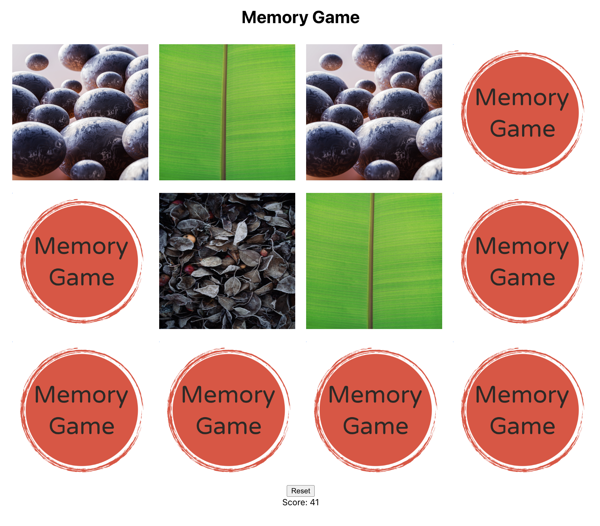

# Memory Game

This week at [Techtonica](https://https://techtonica.org/), we learned [React](https://github.com/facebook/create-react-app) basics. To apply my understanding, I created a memory game. The game uses a set of imported images that a user can click and match based on memory.

## Photo Credits:
Thank you to all who took and shared these amazing photos:
- [Unsplash.com](https://unsplash.com/)
- [Ambilimon Annamala Poosari](https://unsplash.com/@ambi_one)
- [Eugene Golovesov](https://unsplash.com/@eugene_golovesov)
- [Pete Alexopoulos](https://unsplash.com/@pete_a)
- [Aniket Narula](https://unsplash.com/@avisualls)
- [Андрей Курган](https://unsplash.com/@anamnesis33)
- [Rhamely](https://unsplash.com/@rhamely)
- [Jaromír Kalina](https://unsplash.com/@kalinajaromir)
- [Alex Sh](https://unsplash.com/@esalexsh)
- [Robinson Samson](https://unsplash.com/@robinsonsam)

## Available Scripts

In the project directory, you can run:

### `npm start`

Runs the app in the development mode.\
Open [http://localhost:3000](http://localhost:3000) to view it in your browser.

The page will reload when you make changes.\
You may also see any lint errors in the console.

### `npm test`67

Launches the test runner in the interactive watch mode.\
See the section about [running tests](https://facebook.github.io/create-react-app/docs/running-tests) for more information.

### `npm run build`

Builds the app for production to the `build` folder.\
It correctly bundles React in production mode and optimizes the build for the best performance.

The build is minified and the filenames include the hashes.\
Your app is ready to be deployed!

See the section about [deployment](https://facebook.github.io/create-react-app/docs/deployment) for more information.
### `npm run build` fails to minify

This section has moved here: [https://facebook.github.io/create-react-app/docs/troubleshooting#npm-run-build-fails-to-minify](https://facebook.github.io/create-react-app/docs/troubleshooting#npm-run-build-fails-to-minify)

